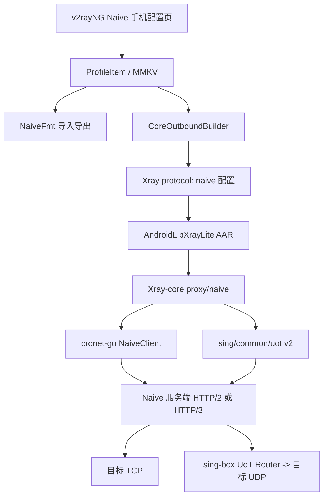

# v2rayNG 原生 NaiveProxy 设计

日期：2026-07-30
状态：已实现；Jenkins Android 构建与独立 sing-box TCP/UoT v2 互通已通过，Android 真机验证待设备
目标分支：`feature/native-naiveproxy`

实施提交、产物、手机配置说明和已验证/未验证边界见
[原生 NaiveProxy 实施与验证记录](../../native-naiveproxy-implementation.md)。

## 1. 背景与目标

v2rayNG 当前不能把 NaiveProxy 作为原生节点使用，已有方案通常依赖外置 `naiveplugin`。本设计的目标是在 Android APK 内直接提供 NaiveProxy 能力，并把它实现为 Xray-core 的一等出站协议，而不是启动插件、第二代理核心或本地 SOCKS 中转进程。

交付必须覆盖真实使用路径：

- 手机端可以新建、编辑、导入、导出和扫码分享 Naive 节点。
- Naive 节点可以参与 v2rayNG/Xray 的路由、DNS、链式代理、VPN 和代理模式。
- 支持 Naive HTTP/2 与 HTTP/3/QUIC。
- 支持 SNI、自定义 CA、ECH、Extra Headers 和并发隧道配置。
- 支持 UDP over TCP（UoT）v1/v2，默认开启 v2。
- UDP 不允许静默直连或无提示降级。
- 使用独立 Jenkins Job 和 Docker 构建环境生成 AAR、APK、测试报告与联调证据。
- 使用固定提交的 sing-box Naive 入站做隔离互通验证；当前已完成 HTTP/2 TCP 与默认 UoT v2 UDP，QUIC/ECH 活体互通仍列为后续验证项。

## 2. 已确认的关键决策

1. 采用“Xray-core 一等 Naive 出站”方案。
2. 不依赖 `naiveplugin`，不内嵌第二套 sing-box 客户端核心，不使用本地 SOCKS 旁路。
3. UoT 默认开启，默认版本固定为 v2；v1 仅用于旧服务端兼容。
4. 手机端提供完整配置页，不把高级参数写死在核心或 Jenkins 中。
5. sing-box 只作为隔离测试服务端，不进入 APK，也不修改现有 Caddy、UAMS、Old DC Job 或容器。考虑 NUC 磁盘余量，当前 E2E 使用临时进程和临时证书，未部署常驻 Compose 服务。
6. Jenkins 不从 Chromium 源码构建 Cronet，而是使用 `cronet-go/lib/android_*` 发布的四个 Android 平台 Go 模块及其中的预构建静态库。
7. 不提供底层不支持的“跳过证书验证”选项。

## 3. 非目标

- 不修改 NaiveProxy 协议本身。
- 不尝试让标准 Caddy/`klzgrad/forwardproxy` 获得 UoT 服务端能力。
- 不在第一版提供 Naive 入站；仅实现客户端出站。
- 不重构 v2rayNG 其他协议的配置模型和编辑页面。
- 不把 Jenkins 变成通用任意仓库执行器。
- 不在 NUC 上执行 Docker 全局清理或删除其他 Job 的缓存、镜像、卷与工作区。

## 4. 上游基线与仓库边界

设计基于以下只读快照：

| 仓库 | 基线 | 职责 |
|---|---|---|
| `2dust/v2rayNG` | `596084b9398c2aeb136190af659b864dfe097bc6` | Android 节点模型、Compose 编辑页、导入导出、Xray JSON 生成、APK |
| `2dust/AndroidLibXrayLite` | `d1d167b508457ebfd650c9e99bfca50c054c98df` | 固定 Xray-core 版本并通过 gomobile 生成 Android AAR |
| `XTLS/Xray-core` | `5ca6f4b7d4dc20a881d4330e498892697627ec0c` | 一等 `naive` 出站、Cronet 生命周期、TCP、UoT UDP、DNS 与错误处理 |
| `SagerNet/cronet-go` | 采用与当前 sing-box Naive 实现一致的固定伪版本 | Naive/Cronet Go API 与各 Android ABI 预构建库 |
| `SagerNet/sing-box` | 联调时固定提交或不可变镜像摘要 | Jenkins/NUC Naive 服务端与 UoT/ECH 兼容基准 |

实施时创建三个公开 fork：

- `sola97/v2rayNG`
- `sola97/AndroidLibXrayLite`
- `sola97/Xray-core`

`origin` 指向 fork，另设只读 `upstream` 指向原项目。每个仓库使用同名功能分支 `feature/native-naiveproxy`。版本通过明确的 commit 或 Go pseudo-version 锁定，不依赖浮动的 `main`。

## 5. 总体架构



边界要求：

- v2rayNG 只处理配置、展示和 JSON 生成，不直接调用 Cronet。
- AndroidLibXrayLite 只负责绑定和打包，不承载协议业务逻辑；它通过 Android/架构 build tags 分别空导入四个 `cronet-go/lib/android_*` 模块，使对应 ABI 的 Cronet 静态库进入最终 AAR。
- Xray-core 负责 Naive 的实际连接、DNS、UoT、生命周期、日志和失败语义。
- sing-box 仅作为测试服务端，不进入 Android APK 客户端架构。

## 6. 手机端数据模型

沿用项目当前扁平 `ProfileItem` 风格，不为单一协议引入新的通用配置框架。新增 `EConfigType.NAIVE`，建议使用未占用值 `11`，并新增以下 Naive 专用字段：

| 字段 | 类型 | 默认值 | 说明 |
|---|---|---:|---|
| `naiveTransport` | `String?` | `https` | `https` 表示 HTTP/2，`quic` 表示 HTTP/3 |
| `naiveInsecureConcurrency` | `Int?` | `1` | Naive 并发隧道数；QUIC 模式固定为 1 |
| `naiveExtraHeaders` | `Map<String, String>?` | 空 | 额外 HTTP 请求头，Header 名称大小写不敏感去重 |
| `naiveUdpOverTcp` | `Boolean?` | `true` | 是否启用 UoT |
| `naiveUdpOverTcpVersion` | `Int?` | `2` | 只允许 1 或 2 |
| `naiveQuicCongestionControl` | `String?` | 空 | `bbr`、`bbr2`、`cubic`、`reno` 或底层默认 |
| `naiveTrustedRootCertificates` | `String?` | 空 | PEM 格式自定义 CA |
| `naiveEchEnabled` | `Boolean?` | `false` | ECH 开关 |
| `naiveEchConfig` | `String?` | 空 | `ECH CONFIGS` PEM |
| `naiveEchQueryServerName` | `String?` | 空 | 自动发现时查询的域名 |
| `naiveEchDnsServer` | `String?` | 空 | 自动发现使用的 DoH URL；只在未提供固定 ECH Config 时需要 |

复用现有字段：

- `remarks`
- `server`
- `serverPort`
- `username`
- `password`
- `sni`

不复用 `insecure`、通用 `network` 或 `pinnedCA256`：Cronet 的 TLS、传输和 CA 语义与 Xray 通用流设置不同，复用会产生看似相同但实际不兼容的配置。

新建节点与导入未声明 UoT 的 Naive 链接时，显式写入 `naiveUdpOverTcp=true` 和 `naiveUdpOverTcpVersion=2`，不依赖空值的隐式解释。

## 7. 手机端配置页面

新增 `ServerNaiveActivity : BaseServerActivity`，沿用当前 Compose、`ServerUiState`、`ServerEditorScaffold` 和 `validateProtocolConfig` 结构。

### 7.1 基础设置

- 备注
- 服务器地址
- 端口，默认 443
- 用户名
- 密码，使用密码输入控件

### 7.2 传输设置

- 传输协议：`HTTPS / HTTP/2`、`QUIC / HTTP/3`
- SNI；为空时使用服务器域名
- 并发隧道数；HTTPS 默认 1，必须大于 0
- QUIC 拥塞控制；仅 QUIC 模式显示

QUIC 模式不支持并发数大于 1。界面切换到 QUIC 时显示“固定为 1”，配置生成器也必须输出 1，不能等到核心启动后才报错。

### 7.3 UDP 设置

- `UDP over TCP` 开关，默认开启
- UoT 版本下拉框，默认 v2，支持 v1
- 兼容性说明：sing-box Naive 入站支持 UoT；标准 Caddy/forwardproxy 通常不支持

关闭 UoT 时显示明确提示：该节点只代理 TCP，匹配到该出站的 UDP 会失败，不会自动直连。

### 7.4 TLS 与 ECH

- SNI
- 自定义 CA PEM
- ECH 开关
- ECH Config PEM
- ECH 查询服务器名称
- ECH DoH 解析器

ECH 有两条完整路径：

1. 提供固定 `ECH CONFIGS` PEM：Cronet 注入 HTTPS/SVCB 响应，无需额外外部查询。
2. 不提供固定 Config：必须提供 DoH URL，由 Xray Naive DNS 适配器通过 Xray dialer 查询 HTTPS 记录。

不允许在第二种路径静默改用系统 DNS，以免产生未提示的 DNS 旁路。

### 7.5 Extra Headers

使用可增删的键值行，不要求用户手写 JSON。保存前执行：

- Header 名称和值不能包含 CR/LF。
- Header 名称按大小写不敏感规则去重。
- 禁止覆盖 `Proxy-Authorization`、`Padding`、`Host`、`:authority`、`-connect-authority`、`Content-Length` 及 hop-by-hop 连接头。
- 日志、节点列表和错误信息不得输出 Header 值。

## 8. 导入、导出与分享链接

新增 `NaiveFmt`，支持：

- `naive+https://`
- `naive+quic://`
- 剪贴板、二维码和订阅文本导入
- v2rayNG 备份 JSON
- sing-box `type: "naive"` 出站导入
- Xray `protocol: "naive"` 出站导入

优先兼容 Husi 已采用的链接参数：

- `sni`
- `extra-headers`
- `insecure-concurrency`

v2rayNG 扩展参数：

| 参数 | 含义 |
|---|---|
| `uot=0` | 关闭 UoT |
| `uot=1` | 开启 UoT v1 |
| `uot=2` | 开启 UoT v2，默认导出值 |
| `quic-congestion-control` | QUIC 拥塞控制 |
| `ech=1` | 开启 ECH |
| `ech-config` | URL 编码的 ECH Config PEM |
| `ech-query-server-name` | ECH 查询域名 |
| `ech-dns-server` | URL 编码的 DoH URL |
| `trusted-root-cert` | URL 编码的 CA PEM |

未知参数应忽略，已识别参数出现非法值时导入失败并指出字段，不使用默认值掩盖错误。

导出必须无损保留手机端可配置字段。链接过长导致二维码容量不足时，复制链接仍可用，二维码入口明确提示改用文件或剪贴板，不截断配置。

## 9. Xray JSON 配置

Naive TLS 由 Cronet 内部处理，不能再套一层 Xray `streamSettings.security=tls`。建议的 JSON 结构如下：

```json
{
  "protocol": "naive",
  "tag": "proxy",
  "settings": {
    "address": "example.com",
    "port": 443,
    "username": "user",
    "password": "password",
    "insecureConcurrency": 1,
    "extraHeaders": {
      "User-Agent": "Mozilla/5.0"
    },
    "udpOverTcp": {
      "enabled": true,
      "version": 2
    },
    "quic": false,
    "quicCongestionControl": "",
    "tls": {
      "serverName": "example.com",
      "certificate": [],
      "ech": {
        "enabled": false,
        "config": [],
        "queryServerName": "",
        "dnsServer": ""
      }
    }
  },
  "mux": {
    "enabled": false,
    "concurrency": -1
  }
}
```

Naive 自己已经管理连接池和并发隧道，v2rayNG 全局 Mux 必须对 `naive` 出站禁用，避免双重复用改变协议行为。

## 10. Xray-core 实现

### 10.1 文件与注册

新增：

- `proxy/naive/config.proto`
- `proxy/naive/config.pb.go`
- `proxy/naive/outbound.go`
- `proxy/naive/dns.go`
- `proxy/naive/outbound_test.go`
- `infra/conf/naive.go`
- `infra/conf/naive_test.go`

并在 `infra/conf/xray.go` 的出站加载器注册 `naive`。核心必须能够直接加载 `protocol: "naive"`，不能由 Android 绑定层把它伪装成 SOCKS/HTTP。

### 10.2 依赖

Xray-core 固定引入：

- `github.com/sagernet/cronet-go`
- `github.com/sagernet/sing/common/uot`

AndroidLibXrayLite 固定引入 `github.com/sagernet/cronet-go/lib/android_386`、`android_amd64`、`android_arm` 和 `android_arm64`，并在对应 Android/架构 build-tag 文件中空导入。这样 Xray-core 保持通用核心边界，Android 绑定层只解析并链接四个 Android 预构建静态库，不会因为 `cronet-go/all` 的模块图下载桌面和 iOS/tvOS 库。Android 四个 ABI 分别由 Go 模块提供，不在 Jenkins 中编译 Chromium。

引入 Cronet 会提升 `github.com/sagernet/sing` 的最小版本。实施前必须先运行 Xray 现有 `common/singbridge`、Shadowsocks 2022 和相关 Go 测试；不能只验证新包编译。

### 10.3 客户端生命周期

一个 Xray Naive 出站只创建一个 `cronet.NaiveClient`：

- 第一个 `Process` 调用拿到 Xray `internet.Dialer` 后，在互斥保护下创建并启动客户端。
- 后续 TCP/UDP 连接复用同一个 Cronet Engine 和连接池。
- 初始化失败会被缓存并返回，不在每个请求中无限重试创建新 Engine。
- 出站 `Close()` 关闭 Naive 客户端、活动 TCP/UoT 包连接并等待 Cronet 活动连接释放；`uot.Client` 本身不拥有独立 Engine。
- 日志只记录服务器、传输、UoT 版本和 Cronet 版本，不记录密码、Header 值、证书或 ECH 内容。

### 10.4 Xray dialer 与 DNS

底层连接通过 `singbridge.NewDialer(dialer)` 适配到 Cronet，确保 Xray 的 `sendThrough`、`sockopt`、链式出站和 Android VPN fd protect 路径仍然生效。

`cronet-go` 要求提供原始 DNS 消息解析器：

- A/AAAA：调用 Xray `features/dns.Client.LookupIP` 后合成标准 DNS 响应。
- 固定 ECH Config：由 Cronet 的 ECH 包装器直接合成 HTTPS/SVCB 响应。
- 动态 ECH：通过用户配置的 DoH URL发送 `application/dns-message` 请求，HTTP 连接使用同一个 Xray dialer。
- 不支持的查询类型返回明确的 DNS RCODE，不返回空默认值掩盖错误。

### 10.5 TCP

TCP 请求使用 `NaiveClient.DialEarly` 获取连接，再通过 Xray `singbridge.CopyConn` 在 `transport.Link` 和 Cronet 连接之间双向复制。目标地址来自当前 Xray session，Naive 出站本身不修改路由目标。

### 10.6 UDP / UoT

当目标网络为 UDP：

- UoT 未启用：立即返回“Naive UDP requires UDP over TCP”错误。
- UoT 启用：构造 `uot.Client`，版本来自配置。
- 使用 `uot.Client.ListenPacket`，并通过 Xray 现有 `singbridge.PacketConnWrapper` 与 `bufio.CopyPacketConn` 保持 UDP 包边界和每包目标地址。
- 不使用 Xray XUDP 替代 UoT；两者是不同协议。
- v2rayNG 对 Naive 禁用全局 Mux/XUDP，避免额外封装。

UoT v2 的魔法目标为 `sp.v2.udp-over-tcp.arpa`。标准 Caddy/forwardproxy 不识别它，因此 UDP 联调必须使用支持 UoT Router 的 sing-box Naive 入站。

### 10.7 网络切换

Cronet 会复用连接池。Android 底层网络切换时，应由 AndroidLibXrayLite 暴露 `notifyNetworkChanged()`，调用 Xray Naive 包中的连接池重置函数，对所有活动 Naive Engine 执行 `CloseAllConnections()`。v2rayNG 在现有 ConnectivityManager 回调中调用该接口。

该操作只关闭旧连接，不销毁配置或重启整个 VPN；新请求会在新底层网络上建立连接。

## 11. 错误处理

错误分三层：

### 11.1 手机保存前错误

- 地址为空或端口非法
- HTTPS 并发数小于 1
- QUIC 模式并发数不为 1
- UoT 版本不是 1/2
- 拥塞控制值未知
- Header 重复、换行或覆盖保留字段
- CA PEM、ECH Config PEM 格式非法
- ECH 开启、Config 为空且 DoH URL 为空或非法

### 11.2 Xray 配置加载错误

Xray 重复校验所有外部 JSON 字段。Android 校验不能替代核心校验，因为用户可以导入完整 JSON。

### 11.3 运行时错误

- 认证失败
- TLS/CA/ECH 验证失败
- HTTP/2 或 HTTP/3 握手失败
- 服务端不支持 UoT
- DoH 查询失败
- Cronet Engine 初始化或关闭失败

运行时错误必须带 `naive:` 前缀及阶段信息，例如 `naive: start cronet engine`、`naive: dial TCP target`、`naive: open UoT v2 packet connection`，同时避免泄露凭据。

## 12. AndroidLibXrayLite

AndroidLibXrayLite fork 通过 `go.mod replace` 或固定 pseudo-version 指向 Xray-core fork，构建过程保持单一职责：

1. 下载 geodata 资源。
2. 下载 Go 模块，其中包括四个 Android Cronet 静态库模块。
3. 使用 Go 1.26、Android NDK 29 和 `gomobile bind -androidapi 24` 构建 `libv2ray.aar`。
4. 验证 AAR 包含 `armeabi-v7a`、`arm64-v8a`、`x86`、`x86_64`。
5. 验证每个 ABI 的 `libgojni.so` 已包含 Naive/Cronet 实现，不要求运行时下载额外 `.so` 或 APK 插件。

新增 Android 绑定方法：

- `notifyNetworkChanged()`：重置 Naive Cronet 连接池。

不向 Android 层暴露 `NaiveClient` 对象，避免把 Xray 出站生命周期拆到 Kotlin 管理。

## 13. Jenkins 与 Docker 构建

复用现有技能中的 Jenkins/NUC 连接方式，但创建独立 Job：

- Jenkins：`https://jenkins-nuc.sora.vip/`
- Job：`v2rayng-naive-android-ci`
- NUC：`192.168.2.2`
- 不修改 `uams-nuc-ci`、Old DC Job 或其 workspace

### 13.1 Pipeline 参数

- `XRAY_REF`
- `ANDROID_LIB_REF`
- `V2RAYNG_REF`
- `BUILD_FDROID`
- `BUILD_PLAYSTORE`
- `RUN_E2E`
- `RUN_ANDROID_SMOKE`，仅在存在已授权 ADB 设备/Agent 时启用

仓库 URL固定为批准的三个公开 fork，参数只允许选择 ref，不能传入任意脚本或仓库 URL。

### 13.2 构建镜像

专用 Dockerfile 固定：

- Linux 基础镜像摘要
- JDK 17
- Go 1.26
- Android command-line tools
- Android platform/build-tools 37
- Android NDK 29.0.14206865
- git、unzip、zip、curl、ca-certificates、protobuf 工具
- gomobile 固定 commit/version

不使用宿主机临时安装的 SDK/JDK/Go，保证 Jenkins 可复现。

### 13.3 Pipeline 阶段

当前已落地的阶段为：

1. `Validate parameters`：只接受受限 Git ref。
2. `Resource preflight`：工作区文件系统少于 8 GiB 时失败。
3. `Checkout fixed forks`：从三个固定公开 fork 检出 ref，并记录实际 commit。
4. `Dependency consistency`：确认 AndroidLib 固定到所选 Xray 提交，且只链接四个 Android Cronet 平台模块。
5. `Linux tests, Android AAR and app`：在固定 Docker 工具链内运行 Xray Naive、配置、singbridge、Shadowsocks 2022 测试，构建四 ABI AAR，运行 v2rayNG F-Droid 单测并构建 APK。
6. `Verify AAR`：检查四 ABI `libgojni.so`、AAR 完整性、SHA-256 与 `notifyNetworkChanged()` 绑定。
7. `Verify Android tests and APK`：发布 JUnit，检查所有 APK ZIP 完整性、SHA-256、大小以及 Universal APK 的四 ABI。
8. `Archive`：只归档 AAR、APK、源码包、JUnit/HTML 报告、提交清单、API 和大小/哈希证据。

`RUN_E2E` 与 `RUN_ANDROID_SMOKE` 在 Jenkins 中仍然 fail closed：启用时会明确失败，不会伪装成已执行。当前 sing-box E2E 由 `ci/e2e/invoke-naive-e2e.ps1` 独立运行，真机门禁等待授权 ADB 设备后再接入。

### 13.4 缓存与资源控制

NUC 当前磁盘和内存余量有限，Pipeline 必须：

- 使用独立 Gradle、Go module、Android SDK 缓存卷。
- 每次只运行一个四 ABI AAR 构建，禁止并发占满内存。
- 构建前检查可用空间，低于安全阈值时失败并报告，不自动清理其他项目。
- 仅清理本 Job 已过期的 workspace 和明确标记的临时容器。
- 禁止执行无范围的 `docker system prune`。

## 14. 隔离 sing-box 互通测试

当前实现位于 `ci/e2e/`，固定以下源码并生成可追溯清单：

- Xray：`3ac438417f44ad853477a3f317f27ae18620f6b0`
- sing-box：`4f7f89463ccfa506f90c46c715cf9798159d2c44`
- Windows Cronet 平台模块：`v0.0.0-20260712142643-1e5048bd5587`

Runner 会构建 Xray、sing-box 和测试程序，生成临时 CA/服务端证书，在随机回环端口启动：

- sing-box `type: "naive"` HTTPS 入站；
- TCP echo 服务；
- UDP echo 服务；
- 两个 Xray `dokodemo-door` 入站；
- Xray 原生 `protocol: "naive"` 出站。

UDP 配置只写 `udpOverTcp.enabled=true`，故意不写 `version`，同时通过 Xray 配置单测确认核心默认值为 v2。真实互通结果为 TCP 成功、UDP echo 成功。整个过程不启动 `naiveplugin`、本地 SOCKS 桥接或第二套客户端核心；sing-box 只承担服务端角色。

以下项目尚未冒充为已完成：HTTP/3/QUIC 活体互通、ECH 正反例、UoT v1 活体兼容、DNS UDP 活体查询和 Caddy 无直连负例。对应核心配置与校验代码已进入单元/编译验证，但仍需独立集成环境补测。

## 15. 测试策略与验收

### 15.1 Xray-core 单元测试

- JSON 配置到 protobuf 的完整映射。
- 缺少地址、端口、TLS、错误 UoT 版本、错误拥塞控制时失败。
- Header 保留字段和 CR/LF 校验。
- ECH PEM、CA PEM 校验。
- A/AAAA DNS 响应合成。
- 固定 ECH Config 的 HTTPS/SVCB 注入。
- DoH 动态 ECH 查询。
- 单出站只启动一个 Cronet Engine。
- Close 与初始化失败的并发生命周期。
- UoT v1/v2 UDP 包边界和多目标地址。

### 15.2 v2rayNG 单元测试

- 新建 Naive 节点默认 `UoT=true, version=2`。
- `naive+https` 与 `naive+quic` 解析。
- 未携带 `uot` 时默认 v2。
- `uot=0/1/2` 行为。
- 所有链接字段无损 round-trip。
- Husi 基础链接兼容。
- sing-box Naive JSON 导入。
- `ProfileItem -> protocol: naive` JSON。
- Naive 出站禁用 Xray Mux。
- QUIC 并发固定 1。
- Extra Headers UI state 保存和恢复。

### 15.3 端到端验证状态

已验证：

- HTTP/2 Naive TCP echo 成功。
- 未显式配置 UoT 版本时，默认 v2 的 UDP echo 成功。
- 自签测试 CA 由 Xray 作为自定义 CA 加载并完成 TLS 连接。
- 测试服务端为固定提交的 sing-box Naive 入站。

待补验证：

- HTTP/3 Naive TCP。
- UoT v2 DNS 查询和 UoT v1 兼容。
- ECH 正反例。
- Extra Headers 前置代理活体验证。
- Caddy TCP 成功、UDP 明确失败且无直连的负例。

### 15.4 Android 运行验证

没有授权的物理 Android 设备或稳定模拟器时，Jenkins 只能确认 AAR/APK、Go 集成和 JVM 单元测试；独立 runner 可以确认桌面平台上的 Xray/sing-box TCP 与 UoT 互通，但二者都不能替代 Android 真机运行验证。

获得 ADB 设备后至少验证：

- 手机端新建、编辑、保存和重开 Naive 节点。
- 扫码导入和导出。
- VPN 模式 TCP 浏览。
- VPN 模式 UDP DNS/echo。
- Wi-Fi/移动网络切换后连接恢复。
- 日志中没有密码、Header 值、CA 或 ECH 内容。

## 16. 提交与推送策略

遵守“一个完整功能完成后即时提交并 push”，按可独立验证的能力拆分：

1. Xray Naive 配置模型与解析测试。
2. Xray Cronet TCP 出站。
3. Xray UoT v1/v2 UDP。
4. Xray QUIC、CA、ECH、Headers 与 DNS。
5. AndroidLibXrayLite AAR 集成和网络切换通知。
6. v2rayNG 数据模型、导入导出和配置生成。
7. v2rayNG 手机配置页与校验。
8. Jenkinsfile、Dockerfile、Compose 与端到端测试。

每个提交只包含对应仓库和功能的文件；不混入上游同步、格式化全仓库或无关重构。

## 17. 风险与验证门槛

| 风险 | 应对 |
|---|---|
| Cronet 静态库使 AAR/APK 体积明显增加 | Jenkins 输出按 ABI 大小报告；不删除 ABI 伪装成优化 |
| `cronet-go` 提升 `sagernet/sing` 版本 | 扩大 Xray singbridge/SS2022 回归测试后再接受升级 |
| Caddy 不支持 UoT | UI 明示；使用 sing-box 联调；不自动直连 |
| ECH 自动发现产生 DNS 旁路 | 只允许固定 Config 或显式 DoH，经 Xray dialer 发送 |
| Cronet 连接池在网络切换后持有旧连接 | Android 网络回调调用 `CloseAllConnections()` |
| NUC 资源不足 | 不编 Chromium；顺序构建；磁盘预检；隔离缓存 |
| Jenkins 能编译但 Android 实机行为未知 | 明确区分 CI 结果和 ADB 真机验证，不把前者冒充后者 |

## 18. 许可证与发布合规

当前相关许可证包括：

- v2rayNG：GPL-3.0
- AndroidLibXrayLite：LGPL-3.0
- Xray-core：MPL-2.0
- cronet-go 及其平台库模块：GPL-3.0-or-later
- NaiveProxy：BSD-3-Clause

发布 APK/AAR 时必须保留各项目许可证与版权声明，并在构建产物的 commit manifest 中记录实际使用的源码仓库、commit 和 Go 模块版本。仓库 README 或应用关于页应提供对应源码 fork 链接，不能只分发二进制而不提供可追溯源码。实现阶段如引入新的第三方包，Jenkins 生成依赖许可证清单并作为产物归档。

本节是工程交付约束，不替代正式法律意见。

## 19. 完成标准

实现交付已经满足“不使用插件、原生核心、手机可配置、默认 UoT v2、真实 sing-box UDP、Jenkins 可复现 AAR/APK”这些主路径。以下清单保留为发布级完成标准；其中 HTTP/3/ECH 活体、Caddy 负例和 Android 真机项仍待补齐，详见实施记录。

只有同时满足以下条件，原生 Naive 功能才达到发布级完成：

- APK 内不需要安装或调用 `naiveplugin`。
- Xray 能直接加载并运行 `protocol: "naive"`。
- 手机端能完整配置并持久化所有已承诺字段。
- 默认 UoT v2，并在 sing-box 服务端上完成真实 UDP 测试。
- HTTP/2、HTTP/3、CA、ECH、Headers 和分享链接路径有对应验证。
- Caddy 不支持 UDP 时不会直连或静默成功。
- Jenkins 可从三个固定 fork/ref 可复现生成 AAR 和 APK。
- 产物、测试结果、未验证风险和源码 commit 均可追溯。

## 20. 参考实现与协议依据

- [cronet-go](https://github.com/SagerNet/cronet-go)
- [sing-box Naive outbound](https://github.com/SagerNet/sing-box/blob/testing/protocol/naive/outbound.go)
- [sing-box Naive outbound 配置](https://github.com/SagerNet/sing-box/blob/testing/docs/configuration/outbound/naive.zh.md)
- [sing-box UDP over TCP](https://github.com/SagerNet/sing-box/blob/testing/docs/configuration/shared/udp-over-tcp.zh.md)
- [sing-box Naive inbound](https://github.com/SagerNet/sing-box/blob/testing/protocol/naive/inbound.go)
- [klzgrad/forwardproxy](https://github.com/klzgrad/forwardproxy)
